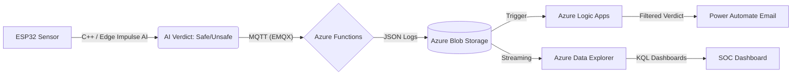

# 👻 Ghost Node: AI-Powered Edge Wi-Fi Threat Intelligence

**Ghost Node** is a distributed IoT security pipeline that migrates Wi-Fi threat detection from the cloud to the hardware edge. By deploying an **Edge Impulse AI** model on an ESP32, the system identifies, classifies, and alerts on network vulnerabilities in real-time while maintaining 100% data integrity through managed cloud ingestion.

---

## 🏗️ System Architecture

Ghost Node utilizes a hybrid-cloud architecture to bridge local hardware sensing with global alerting and analytics.




---

## 🛠️ Technical Stack

| Layer | Technology |
| --- | --- |
| **Edge Hardware** | ESP32 (Microcontroller) |
| **Edge AI** | Edge Impulse (DSP & Neural Network Classification) |
| **Connectivity** | MQTT (EMQX Broker) |
| **Cloud Processing** | Azure Functions (Serverless), Azure Logic Apps |
| **Data Lake** | Azure Blob Storage |
| **Analytics & Visualization** | Azure Data Explorer (KQL), Power Automate |

---

## 🌟 Key Features

* **On-Device Neural Network:** Categorizes surrounding Wi-Fi networks as `SAFE`, `VULNERABLE`, or `UNSAFE` using on-chip inference.
* **Intelligent Ingestion:** Utilizes managed cloud concurrency to handle high-velocity telemetry bursts without system failure.
* **Event-Driven Alerting:** Routes critical threat detections via Logic Apps and Power Automate for immediate email notifications.
* **Real-Time SOC Dashboard:** A live command center visualizing Signal Strength (RSSI) vs. AI Confidence for threat proximity tracking.

---

## 🧪 Engineering Challenges & Solutions

### 1. Ingestion Throughput & Rate Limiting (429 Errors)

**Challenge:** In high-density Wi-Fi environments, the ESP32 generated telemetry faster than the downstream cloud consumer could process, leading to `429 Too Many Requests` errors and failed trigger runs.
**Solution:** I implemented **Concurrency Control** at the Azure Logic App trigger level. By limiting the **Degree of Parallelism**, I created a managed queue that prevented API throttling while maintaining a 100% processing success rate for all edge data logs. This ensured the system remained resilient during data spikes.

### 2. Signal Proximity vs. AI Confidence

**Challenge:** Identifying whether low AI confidence scores were caused by model inaccuracies or simply weak signal strength (RSSI) from distant networks.
**Solution:** I developed a custom **Kusto (KQL)** scatter plot in Azure Data Explorer. This allowed me to correlate RSSI with Confidence levels in real-time, providing a visual feedback loop to validate the Edge AI model's performance in the field.

---

## 📈 Analytics Deep Dive (KQL)

The following query powers the Threat Activity timeline, visualizing network volatility in 5-minute intervals:

```kusto
// Visualizing threat distribution over time
Sentinel
| extend TaiwanTime = ingestion_time() + 8h
| extend Verdict = tostring(payload.verdict)
| summarize ScanCount = count() by bin(TaiwanTime, 5m), Verdict
| render columnchart with (kind=stacked)

```

---

## 🚀 How to Deploy

1. **Hardware:** Flash the ESP32 with the provided C++ firmware (requires Edge Impulse library).
2. **Broker:** Set up an EMQX instance and configure the Azure Function to subscribe to the `threat/detection` topic.
3. **Cloud:** Deploy the Logic App and enable **Concurrency Control** in the trigger settings.
4. **Monitoring:** Connect Azure Data Explorer to your Blob Storage container for live visualization.

---

## 👩‍💻 Author

**Theresia**
*3rd Year Undergraduate Student | Specializing in IoT & Edge Security*

```
```
